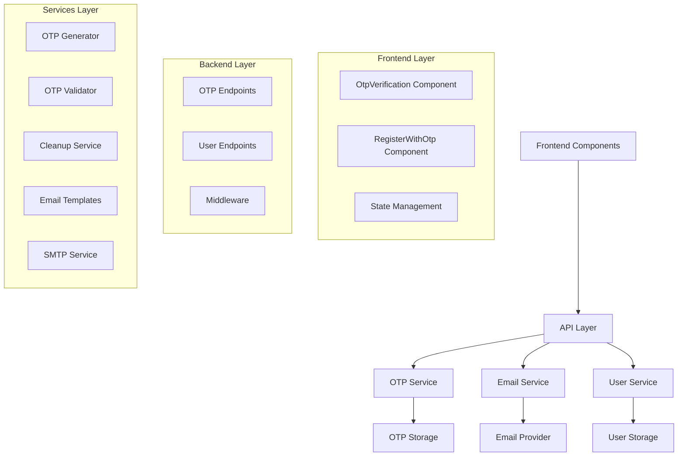
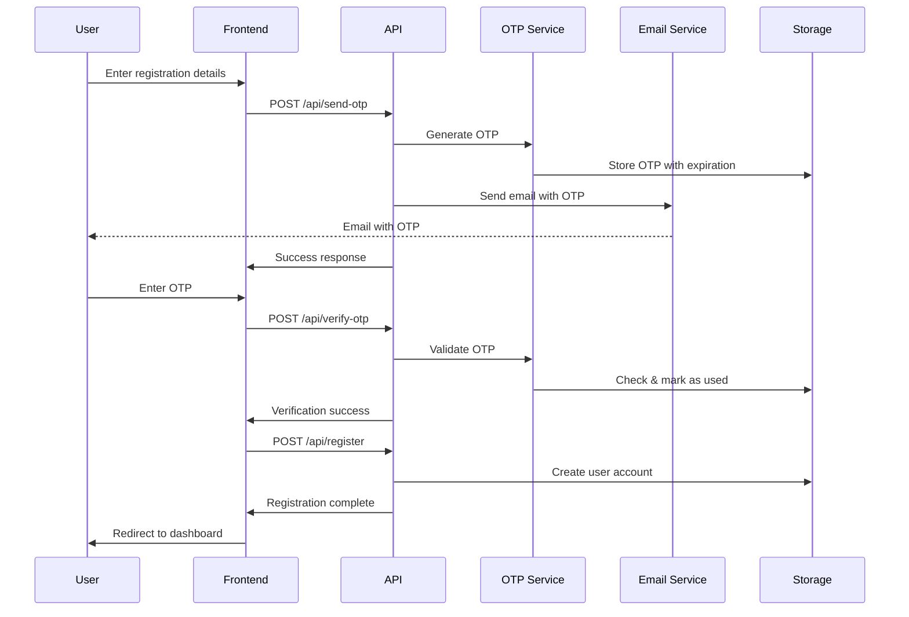

# OTP Authentication System Design Document

## Overview

This design document outlines a robust OTP (One-Time Password) authentication system that addresses current issues including duplicate API calls, race conditions, JSON parsing errors, and poor user experience. The system provides secure email-based verification for user registration and login processes with comprehensive error handling and state management.

## Architecture

### High-Level Architecture



### System Flow



## Components and Interfaces

### Backend Components

#### 1. OTP Service (`otpService.js`)

**Purpose:** Centralized OTP management with proper state handling and race condition protection.

**Key Features:**
- Thread-safe OTP operations using atomic operations
- Automatic cleanup of expired OTPs
- Rate limiting for OTP requests
- Comprehensive logging and monitoring

**Interface:**
```javascript
class OtpService {
  async generateOtp(email, options = {})
  async verifyOtp(email, otp)
  async resendOtp(email)
  async cleanupExpiredOtps()
  isRateLimited(email)
}
```

#### 2. Email Service (`emailService.js`)

**Purpose:** Reliable email delivery with fallback mechanisms and template management.

**Key Features:**
- Gmail SMTP integration with fallback to console logging
- Professional email templates
- Delivery status tracking
- Error handling and retry logic

**Interface:**
```javascript
class EmailService {
  async sendOtpEmail(email, otp, options = {})
  async verifyConnection()
  getEmailTemplate(type, data)
}
```

#### 3. Enhanced API Endpoints

**OTP Endpoints:**
- `POST /api/send-otp` - Generate and send OTP
- `POST /api/verify-otp` - Verify OTP with race condition protection
- `POST /api/resend-otp` - Resend OTP with rate limiting

**User Endpoints:**
- `POST /api/register` - Complete user registration
- `POST /api/login` - User authentication

### Frontend Components

#### 1. Enhanced OtpVerification Component

**Purpose:** Robust OTP input and verification with improved UX.

**Key Features:**
- Individual digit input fields with auto-advance
- Paste support for OTP codes
- Real-time validation and feedback
- Countdown timer for resend functionality
- Loading states and error handling
- Duplicate submission prevention

**Props Interface:**
```javascript
{
  email: string,
  onVerificationSuccess: (email, otp) => void,
  onResendOtp: () => Promise<void>,
  maxAttempts?: number,
  resendCooldown?: number
}
```

#### 2. Enhanced RegisterWithOtp Component

**Purpose:** Streamlined registration flow with OTP verification.

**Key Features:**
- Form validation with real-time feedback
- Secure state management
- Progress indicators
- Error boundary implementation
- Clean separation of concerns

**State Management:**
```javascript
{
  formData: { name, email, password, confirmPassword },
  isOtpSent: boolean,
  isLoading: boolean,
  isVerifying: boolean,
  errors: object
}
```

## Data Models

### OTP Storage Model

```javascript
{
  email: string,           // User's email address
  otp: string,            // 6-digit OTP code
  createdAt: number,      // Timestamp when OTP was created
  expiresAt: number,      // Expiration timestamp
  attempts: number,       // Number of verification attempts
  used: boolean,          // Whether OTP has been used
  usedAt: number,         // Timestamp when OTP was used
  resendCount: number,    // Number of times OTP was resent
  lastResendAt: number    // Last resend timestamp
}
```

### User Model

```javascript
{
  email: string,          // Primary identifier
  name: string,           // User's full name
  password: string,       // Hashed password (in production)
  emailVerified: boolean, // Email verification status
  createdAt: string,      // ISO timestamp
  lastLoginAt: string,    // Last login timestamp
  isActive: boolean       // Account status
}
```

### Rate Limiting Model

```javascript
{
  email: string,          // User's email
  attempts: number,       // Number of attempts
  windowStart: number,    // Rate limit window start
  blocked: boolean,       // Whether user is blocked
  blockedUntil: number    // Block expiration timestamp
}
```

## Error Handling

### Error Categories

1. **Validation Errors**
   - Missing required fields
   - Invalid email format
   - Invalid OTP format
   - Password mismatch

2. **Business Logic Errors**
   - OTP expired
   - OTP already used
   - Rate limit exceeded
   - User already exists

3. **System Errors**
   - Email service unavailable
   - Database connection issues
   - Network timeouts
   - JSON parsing errors

### Error Response Format

```javascript
{
  success: false,
  error: {
    code: string,        // Error code for programmatic handling
    message: string,     // User-friendly error message
    field?: string,      // Field that caused the error (for validation)
    details?: object     // Additional error details (development only)
  },
  timestamp: string      // ISO timestamp
}
```

### Frontend Error Handling Strategy

1. **Network Errors:** Retry with exponential backoff
2. **Validation Errors:** Show field-specific error messages
3. **Rate Limiting:** Show countdown timer and disable actions
4. **System Errors:** Show generic error with retry option
5. **Unexpected Errors:** Error boundary with fallback UI

## Security Measures

### OTP Security

1. **Generation:** Cryptographically secure random 6-digit codes
2. **Storage:** Temporary storage with automatic cleanup
3. **Transmission:** HTTPS only, no OTP in URLs or logs
4. **Validation:** Constant-time comparison to prevent timing attacks
5. **Expiration:** 10-minute expiration with automatic cleanup
6. **Single Use:** OTPs are marked as used after successful verification

### Rate Limiting

1. **OTP Requests:** Maximum 3 OTP requests per 15 minutes per email
2. **Verification Attempts:** Maximum 5 attempts per OTP
3. **Account Lockout:** Temporary lockout after excessive failed attempts
4. **IP-based Limiting:** Additional protection against abuse

### Data Protection

1. **Password Hashing:** bcrypt with salt (production implementation)
2. **Session Management:** Secure JWT tokens with proper expiration
3. **Input Sanitization:** All user inputs sanitized and validated
4. **CORS Configuration:** Restricted to allowed origins only

## Testing Strategy

### Unit Tests

1. **OTP Service Tests**
   - OTP generation and validation
   - Expiration handling
   - Rate limiting logic
   - Cleanup functionality

2. **Email Service Tests**
   - Email sending with mocked SMTP
   - Template rendering
   - Error handling scenarios

3. **API Endpoint Tests**
   - Request validation
   - Response formatting
   - Error scenarios
   - Rate limiting

### Integration Tests

1. **Complete OTP Flow**
   - Registration with OTP verification
   - OTP resend functionality
   - Error scenarios end-to-end

2. **Race Condition Tests**
   - Concurrent OTP verification attempts
   - Simultaneous OTP generation requests
   - Cleanup during active operations

### Frontend Tests

1. **Component Tests**
   - OTP input behavior
   - Form validation
   - State management
   - Error display

2. **User Flow Tests**
   - Complete registration flow
   - OTP verification process
   - Error recovery scenarios

## Performance Considerations

### Backend Optimizations

1. **Memory Management**
   - Automatic cleanup of expired OTPs
   - Efficient data structures for storage
   - Connection pooling for email service

2. **Caching Strategy**
   - Rate limiting data caching
   - Email template caching
   - Configuration caching

### Frontend Optimizations

1. **State Management**
   - Minimal re-renders with proper state structure
   - Debounced input validation
   - Optimistic UI updates

2. **Network Optimization**
   - Request deduplication
   - Proper loading states
   - Error retry with backoff

## Monitoring and Logging

### Key Metrics

1. **OTP Success Rate:** Percentage of successful OTP verifications
2. **Email Delivery Rate:** Percentage of successfully sent emails
3. **Average Verification Time:** Time from OTP send to verification
4. **Error Rates:** Categorized error frequency
5. **Rate Limiting Triggers:** Frequency of rate limit activations

### Logging Strategy

1. **Security Events:** Failed attempts, rate limiting, suspicious activity
2. **Performance Metrics:** Response times, email delivery times
3. **Error Tracking:** Detailed error logs with context
4. **User Journey:** Key user actions for debugging

### Health Checks

1. **Email Service Health:** Regular SMTP connection tests
2. **Storage Health:** OTP storage read/write tests
3. **API Health:** Endpoint response time monitoring
4. **Cleanup Process:** Verification of automatic cleanup operations

## Deployment Considerations

### Environment Configuration

1. **Development:** Console-based email with visible OTPs
2. **Staging:** Real email service with test accounts
3. **Production:** Full security measures and monitoring

### Scalability

1. **Horizontal Scaling:** Stateless design for multiple instances
2. **Database Migration:** Easy transition from in-memory to persistent storage
3. **Load Balancing:** Session-independent request handling
4. **Caching Layer:** Redis integration for distributed caching

This design addresses all current issues while providing a robust, scalable, and secure OTP authentication system that can handle production workloads effectively.